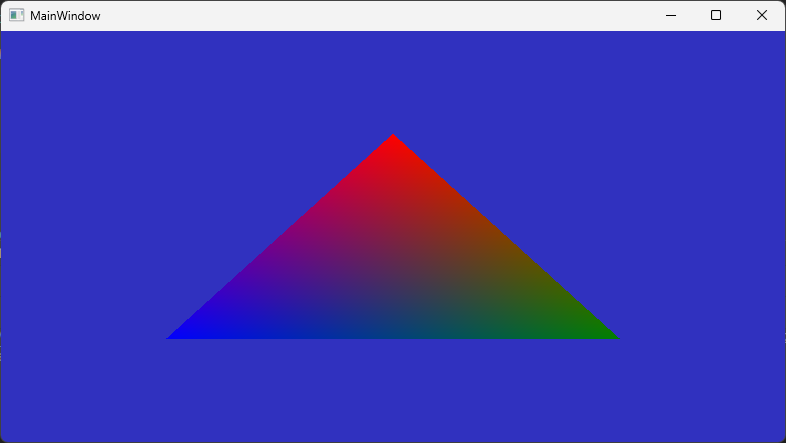

# Intel Driver Example

This example code is to show that the Intel 770 graphics driver version 32.0.101.6078
does not work, while driver 31.0.101.4953 does.

Intel drivers we acquired through Dell. The 31.0.101.6078 driver was the default driver installed
when I received the machine.

## Requirements

- Intel Iris 770 chipset with no discrete GPU
- Dotnet 9
- Driver version 31.0.101.4953 (or equivalent)
- Driver version 32.0.101.6078 (or equivalent)

## Steps to reproduce

### Working example

1. Install version 31.0.101.4953 of the Intel display driver
1. Restart the computer
1. Run the solution
1. Observe the working example (shown below)



### Broken example

1. Install version 32.0.101.6078 of the Intel display driver
1. Restart the computer
1. Run the solution
1. Observe errors in the stack trace (shown below)

```
Fatal error. 0xC0000005
 at OpenTK.Graphics.Wgl.Wgl.DXRegisterObjectNV(IntPtr, IntPtr, UInt32, UInt32, OpenTK.Platform.Windows.WGL_NV_DX_interop)
 at OpenTK.Wpf.GLWpfControlRenderer.ReallocateFramebufferIfNeeded(Double, Double, Double, Double, OpenTK.Wpf.Interop.Format, OpenTK.Wpf.Interop.MultisampleType)
 at OpenTK.Wpf.GLWpfControl.OnRender(System.Windows.Media.DrawingContext)
 at System.Windows.UIElement.Arrange(System.Windows.Rect)
 at System.Windows.Controls.Grid.ArrangeOverride(System.Windows.Size)
 at System.Windows.FrameworkElement.ArrangeCore(System.Windows.Rect)
 at System.Windows.UIElement.Arrange(System.Windows.Rect)
 at MS.Internal.Helper.ArrangeElementWithSingleChild(System.Windows.UIElement, System.Windows.Size)
 at System.Windows.FrameworkElement.ArrangeCore(System.Windows.Rect)
 at System.Windows.UIElement.Arrange(System.Windows.Rect)
 at System.Windows.Controls.Decorator.ArrangeOverride(System.Windows.Size)
 at System.Windows.Documents.AdornerDecorator.ArrangeOverride(System.Windows.Size)
 at System.Windows.FrameworkElement.ArrangeCore(System.Windows.Rect)
 at System.Windows.UIElement.Arrange(System.Windows.Rect)
 at System.Windows.Controls.Border.ArrangeOverride(System.Windows.Size)
 at System.Windows.FrameworkElement.ArrangeCore(System.Windows.Rect)
 at System.Windows.UIElement.Arrange(System.Windows.Rect)
 at System.Windows.Window.ArrangeOverride(System.Windows.Size)
 at System.Windows.FrameworkElement.ArrangeCore(System.Windows.Rect)
 at System.Windows.UIElement.Arrange(System.Windows.Rect)
 at System.Windows.Interop.HwndSource.SetLayoutSize()
 at System.Windows.Interop.HwndSource.set_RootVisualInternal(System.Windows.Media.Visual)
 at System.Windows.Window.SetRootVisualAndUpdateSTC()
 at System.Windows.Window.SetupInitialState(Double, Double, Double, Double)
 at System.Windows.Window.CreateSourceWindow(Boolean)
 at System.Windows.Window.ShowHelper(System.Object)
 at System.Windows.Threading.ExceptionWrapper.InternalRealCall(System.Delegate, System.Object, Int32)
 at System.Windows.Threading.ExceptionWrapper.TryCatchWhen(System.Object, System.Delegate, System.Object, Int32, System.Delegate)
 at System.Windows.Threading.DispatcherOperation.InvokeImpl()
 at MS.Internal.CulturePreservingExecutionContext.CallbackWrapper(System.Object)
 at System.Threading.ExecutionContext.RunInternal(System.Threading.ExecutionContext, System.Threading.ContextCallback, System.Object)
 at MS.Internal.CulturePreservingExecutionContext.Run(MS.Internal.CulturePreservingExecutionContext, System.Threading.ContextCallback, System.Object)
 at System.Windows.Threading.DispatcherOperation.Invoke()
 at System.Windows.Threading.Dispatcher.ProcessQueue()
 at System.Windows.Threading.Dispatcher.WndProcHook(IntPtr, Int32, IntPtr, IntPtr, Boolean ByRef)
 at MS.Win32.HwndWrapper.WndProc(IntPtr, Int32, IntPtr, IntPtr, Boolean ByRef)
 at MS.Win32.HwndSubclass.DispatcherCallbackOperation(System.Object)
 at System.Windows.Threading.ExceptionWrapper.InternalRealCall(System.Delegate, System.Object, Int32)
 at System.Windows.Threading.ExceptionWrapper.TryCatchWhen(System.Object, System.Delegate, System.Object, Int32, System.Delegate)
 at System.Windows.Threading.Dispatcher.LegacyInvokeImpl(System.Windows.Threading.DispatcherPriority, System.TimeSpan, System.Delegate, System.Object, Int32)
 at System.Windows.Threading.Dispatcher.Invoke(System.Windows.Threading.DispatcherPriority, System.Delegate, System.Object)
 at MS.Win32.HwndSubclass.SubclassWndProc(IntPtr, Int32, IntPtr, IntPtr)
 at MS.Win32.UnsafeNativeMethods.DispatchMessage(System.Windows.Interop.MSG ByRef)
 at MS.Win32.UnsafeNativeMethods.DispatchMessage(System.Windows.Interop.MSG ByRef)
 at System.Windows.Threading.Dispatcher.PushFrameImpl(System.Windows.Threading.DispatcherFrame)
 at System.Windows.Application.RunDispatcher(System.Object)
 at System.Windows.Application.RunInternal(System.Windows.Window)
 at FailingIntelDriverTest.App.Main()

Process finished with exit code -1,073,741,819.
```
